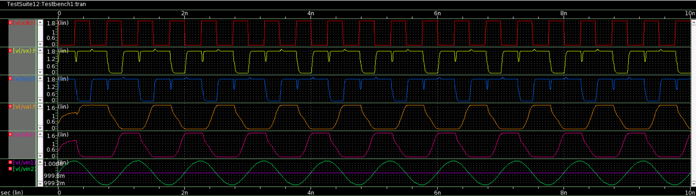
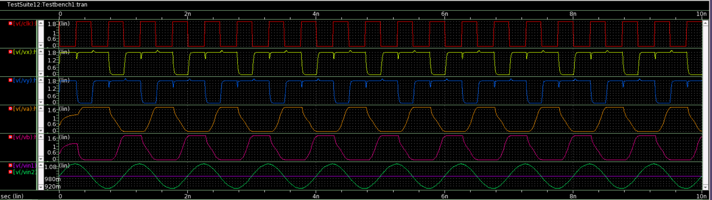
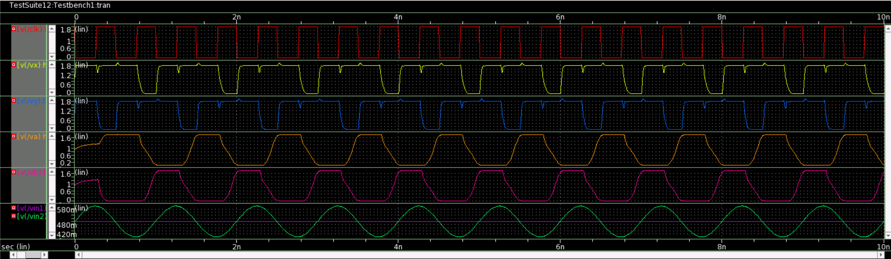
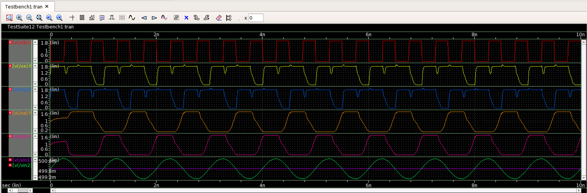

# StrongARM-Latch-based-Analog-Comparator
This repository presents the design of a StrongARM Latch based Analog Comparator implemented using Synopsis Custom Compiler on 28nm CMOS Technology.
# Table of Contents
 * [Introduction](#Introduction)
 * [The StrongARM Latch](#The-StrongARM-Latch)
 * [RS Latch](#RS-Latch)
 * [Tools Used](#Tools-Used)
 * [Pre-Layout Schematics and Simulations](#Pre-Layout-Schematics-and-Simulations)
 * [Netlist of the Circuit](#Netlist-of-the-Circuit)
 * [Observations](#Observations)
 * [Author](#Author)
 * [Acknowledgements](#Acknowledgements)
 * [References](#References)

# Introduction:
A differential Comparator is an integral part of analog to
digital converters where it is used to perform quantisation and
sampling. A standard opamp as a comparator is not preferred
for these applications as it reduces the maximum sampling
frequency that could be attained. In this design, a strongArm
latch is used as the comparator core and is chosen as the core
for this circuit because it consumes zero static power, produces
full swing rail to rail outputs, requires single clock phase and
provides higher sampling bandwidth. The strongArm latch
stage is followed by a RS latch which is used to hold the
output data during precharge phase of the strongArm latch.

# The StrongARM Latch:
The StrongARM latch topology finds wide usage as a sense amplifier, a comparator, or simply a robust
latch with high sensitivity.The latch consists of 5 NMOS and 5 PMOS transistors. Transistor M1 and M2 form the input differential pair, transistor M3-M6 form the cross coupled inverters, S1-S4 are the charging transistors and M7 is the tail current transistor. Operation of the latch consists of three phases, Reset, Amplification, and Regeneration.

During the reset phase, input clock is low which turns of the tail current transistor M7 and the input differential pair M1 and M2 is disconnected. Nodes P,Q,X,Y charge to Vdd through the charging transistors S1,S2,S3,S4 which are on when clock is low. The entire circuit draws no current during reset phase as the cross coupled inverter are turned off.

The amplification phase begins as soon as clock goes from low to high turning off the charging transistors S1,S2,S3,S4 and
turning on the tail current transistor M7, thereby activating the input differential pair M1,M2 which draws current
proportional to the input provided at gate terminals of M1 and M2. The current drawn by M1 and M2 discharges the nodes P and Q which were precharged to Vdd.

The regeneration phase begins when nodes P and Q discharge to Vdd-Vthn , turning M3 and M4 (NMOS transistors of cross coupled inverters) on. Nodes X and
Y then begins discharging from Vdd. Since they form a cross
coupled inverter with positive feedback, the node which discharges faster (i.e the one which draws higher current) and falls down to zero while the other node regenerates back to Vdd, depending on the polarity of input differential votalge. Hence it effectively performs the action of a comparator.
<p align="center">
</br>
  Fig. 1: StrongARM Latch 
</p>

# RS Latch
During the reset phase , the output nodes of the StrongArm Latch is precharged to Vdd, hence erasing its previous output which leads to the current output not representing a valid logic level, which confuses the subsequent stages. This issue is resolved by the addition of a reset-set latch connected to the output terminals of the StrongARM latch. The RS latch can change its state only if one of the output of the previous stage falls to zero. This latch then retains the state as the StrongARM latch enters reset phase. 
<p align="center">
</br>
  Fig. 2: StrongARM Latch followed by RS Latch 
</p>

# Tools Used:

Synopsys Custom Compiler:</b></br>
The Synopsys Custom Compiler™ design environment is a modern solution for full-custom analog, custom digital, and mixed-signal IC design. As the heart of the Synopsys Custom Design Platform, Custom Compiler provides design entry, simulation management and analysis, and custom layout editing features. This tool was used to design the circuit on a transistor level.

Synopsys Primewave:</b></br>
PrimeWave™ Design Environment is a comprehensive and flexible environment for simulation setup and analysis of analog, RF, mixed-signal design, custom-digital and memory designs within the Synopsys Custom Design Platform. This tool helped in various types of simulations of the above designed circuit.

Synopsys 28nm PDK:</b></br>
The Synopsys 28nm Process Design Kit(PDK) was used in creation and simulation of the above designed circuit.

# Pre-Layout Schematics and Simulations:

## Schematics:
### StrongARM Latch:
Implementation of StrongARM Latch Cell:
<p align="center">
</br>
  Fig. 3: StrongARM Latch Schematic 
</p>
<p align="center">
</br>
  Fig. 4: StrongARM Latch Symbol 
</p>

### RS Latch:
Implementation of RS Latch Cell:
<p align="center">
</br>
  Fig. 5: RS Latch Schematic 
</p>
<p align="center">
</br>
  Fig. 6: RS Latch Symbol 
</p>

### Comparator Testbench:
<p align="center">
</br>
  Fig. 6: Testbench 
</p>

## Simulations:
### Transient Analysis:
Input Parameters:
Fclk = 2GHz; Vdd = 1.8V; Vcm = 1V; Vdiff = 1mV
<p align="center">
</br>
  Fig. 6: Testbench 
</p>

Input Parameters:
Fclk = 2GHz; Vdd = 1.8V; Vcm = 1V; Vdiff = 100mV
<p align="center">
</br>
  Fig. 6: Testbench 
</p>

Input Parameters:
Fclk = 2GHz; Vdd = 1.8V; Vcm = 0.5V; Vdiff = 100mV
<p align="center">
</br>
  Fig. 6: Testbench 
</p>

Input Parameters:
Fclk = 2GHz; Vdd = 1.8V; Vcm = 0.5V; Vdiff = 1mV
<p align="center">
</br>
  Fig. 6: Testbench 
</p>

# Netlist of the circuit

Final Netlist of the circuit is as follows,

```

*  Generated for: PrimeSim
*  Design library name: AnalogComparator
*  Design cell name: StrongARM_Latch_tb
*  Design view name: schematic
.lib 'hspice/saed32nm.lib' TT
.param a=0.001
*Custom Compiler Version S-2021.09
*Mon Feb 28 19:02:35 2022

.global gnd! vdd!
********************************************************************************
* Library          : AnalogComparator
* Cell             : StrongARM_Latch
* View             : schematic
* View Search List : hspice hspiceD schematic spice veriloga
* View Stop List   : hspice hspiceD
********************************************************************************
.subckt strongarm_latch clk gnd_1 vdd vin1 vin2 vx vy vt_bulk_n_gnd!
+ vt_bulk_p_vdd!
xm7 net37 clk gnd_1 vt_bulk_n_gnd! n105 w=2u l=0.03u nf=20 m=1
xm4 vy vx net17 vt_bulk_n_gnd! n105 w=5u l=0.03u nf=50 m=1
xm3 vx vy net7 vt_bulk_n_gnd! n105 w=5u l=0.03u nf=50 m=1
xm2 net17 vin2 net37 vt_bulk_n_gnd! n105 w=10u l=0.03u nf=100 m=1
xm1 net7 vin1 net37 vt_bulk_n_gnd! n105 w=10u l=0.03u nf=100 m=1
xs2 net17 clk vdd vt_bulk_p_vdd! p105 w=0.5u l=0.03u nf=5 m=1
xs4 vy clk vdd vt_bulk_p_vdd! p105 w=0.5u l=0.03u nf=5 m=1
xs1 net7 clk vdd vt_bulk_p_vdd! p105 w=0.5u l=0.03u nf=5 m=1
xs3 vx clk vdd vt_bulk_p_vdd! p105 w=0.5u l=0.03u nf=5 m=1
xm6 vy vx vdd vt_bulk_p_vdd! p105 w=2.5u l=0.03u nf=25 m=1
xm5 vx vy vdd vt_bulk_p_vdd! p105 w=2.5u l=0.03u nf=25 m=1
.ends strongarm_latch

********************************************************************************
* Library          : AnalogComparator
* Cell             : RS_Latch
* View             : schematic
* View Search List : hspice hspiceD schematic spice veriloga
* View Stop List   : hspice hspiceD
********************************************************************************
.subckt rs_latch gnd_1 va vb vdd vx vy vt_bulk_n_gnd! vt_bulk_p_vdd!
xm10 net23 vy vdd vt_bulk_p_vdd! p105 w=0.8u l=0.03u nf=8 m=1
xm15 vb va vdd vt_bulk_p_vdd! p105 w=0.8u l=0.03u nf=8 m=1
xm14 va vb vdd vt_bulk_p_vdd! p105 w=0.8u l=0.03u nf=8 m=1
xm8 net13 vx vdd vt_bulk_p_vdd! p105 w=0.8u l=0.03u nf=8 m=1
xm11 net23 vy gnd_1 vt_bulk_n_gnd! n105 w=0.2u l=0.03u nf=2 m=1
xm13 vb net23 gnd_1 vt_bulk_n_gnd! n105 w=0.8u l=0.03u nf=8 m=1
xm12 va net13 gnd_1 vt_bulk_n_gnd! n105 w=0.8u l=0.03u nf=8 m=1
xm9 net13 vx gnd_1 vt_bulk_n_gnd! n105 w=0.2u l=0.03u nf=2 m=1
.ends rs_latch

********************************************************************************
* Library          : AnalogComparator
* Cell             : StrongARM_Latch_tb
* View             : schematic
* View Search List : hspice hspiceD schematic spice veriloga
* View Stop List   : hspice hspiceD
********************************************************************************
xi0 clk gnd! net8 vin1 vin2 vx vy gnd! vdd! strongarm_latch
v3 vin1 gnd! dc=0.5 ac=0
v1 net8 gnd! dc=1.8
v2 clk gnd! dc=0 pulse ( 1.8 0 0 10p 10p 0.25n 0.5n )
c6 vb gnd! c=20f
c5 va gnd! c=20f
v10 vin2 gnd! dc=1 sin ( 0.5 'a' 1G 0 0 0 )
xi12 gnd! va vb net8 vx vy gnd! vdd! rs_latch


.tran '0.001*(10n-0)' '10n' name=tran

.option primesim_remove_probe_prefix = 0
.probe v(*) i(*) level=1
.probe tran v(clk) v(va) v(vb) v(vin1) v(vin2) v(vx) v(vy)

.temp 25


.option primesim_output=wdf


.option parhier = LOCAL


.end

```

# Observations:
The sharp upward and downward spikes in the waveforms of voltage of node X and Y is due to the reset/precharge action and regenerative action of the latch respectively. The operation of the circuit in room temperature was tested with various common mode voltages ranging from 0.5V to 1V and differential voltage ranging from 1mV to a few hundred milli volts with a 20fF capacitor load. The maximum operating frequency of the designed comparator is found to be 2GHz and minimum a differential voltage of 1mV for satisfactory waveforms. The delay in rise and fall of output voltage of RS latch may prove critical in high speed applications. A modified RS latch consisting of more transistors can be used to reduce the delay.  Hence a high speed analog comparator with a maximum clock frequency of 2GHz is designed and simulated using Synopsis Custom Compiler on 28nm CMOS Technology. 

# Author:
• Satish Kumar L, B.Tech(EEE), National Institute of Technology, Tiruchirappalli

# Acknowledgements:
• <a href='https://www.iith.ac.in/events/2022/02/15/Cloud-Based-Analog-IC-Design-Hackathon/'>Cloud Based Analog IC Design Hackathon</a></br>
• <a href='https://www.synopsys.com/'>Synopsys India</a></br>
• <a href='https://www.vlsisystemdesign.com/'>VLSI System Design (VSD) Corp. Pvt. Ltd India</a></br>

# References:
[1] B. Razavi, “The StrongARM Latch [a circuit for all seasons],” IEEE
Solid State Circuits Mag., vol. 7, no. 2, pp. 12–17, Spring 2015. doi:
10.1109/MSSC.2015.2418155.
[2] B. Razavi, ”The Design of a Comparator [The Analog Mind],” in IEEE
Solid-State Circuits Magazine, vol. 12, no. 4, pp. 8-14, Fall 2020, doi:
10.1109/MSSC.2020.3021865.
[3] A. Almansouri, A. Alturki, A. Alshehri, T. Al-Attar and H. Fariborzi, ”Improved StrongARM latch comparator: Design, analysis and
performance evaluation,” 2017 13th Conference on Ph.D. Research
in Microelectronics and Electronics (PRIME), 2017, pp. 89-92, doi:
10.1109/PRIME.2017.7974114.
[4] R vinoth, S Ramasamy, ”Design and Implementation of High Speed
Latched Comparator using gm/Id Sizing Method


